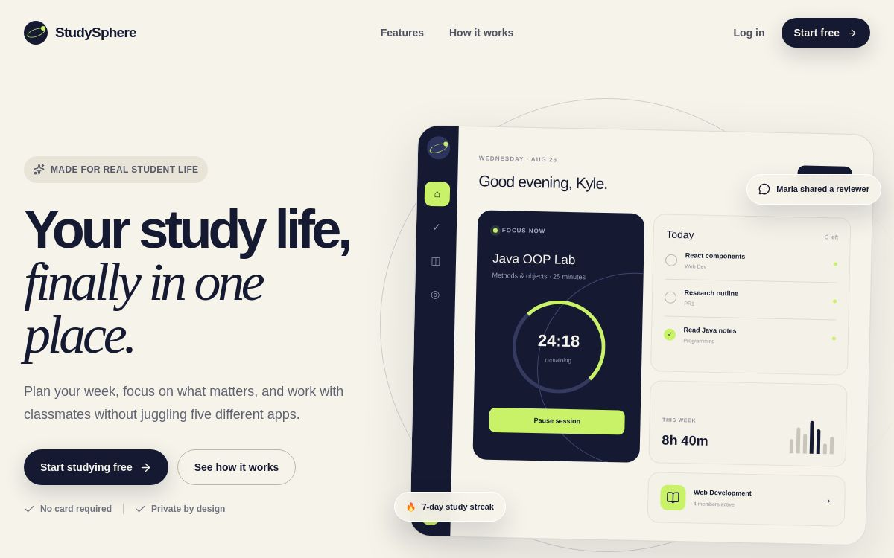
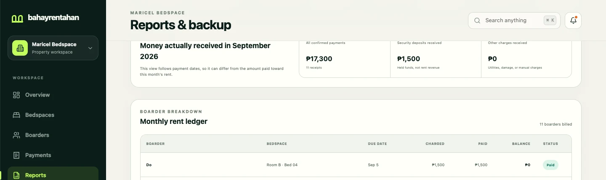
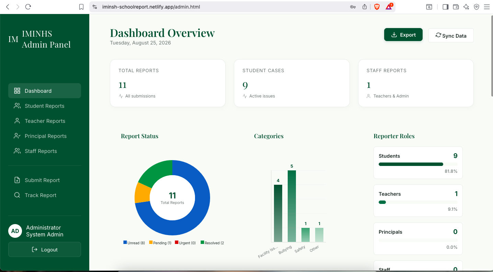

# Kyle Christian Belono

**Frontend Developer & IT Instructor**

I'm a developer who teaches, and a teacher who never stopped building.

I like turning practical problems into software that people can understand and actually use. Most of my recent work has been around responsive React applications, authentication, data-heavy interfaces, permissions, and the small product decisions that make a system feel simpler.

Teaching is a big part of how I think about development. If I can't explain why something works, I probably don't understand it well enough yet.

### Current stack

---

## What I'm building

### StudySphere

StudySphere started from a simple frustration: studying usually means jumping between notes, task managers, group chats, calendars, and focus tools.

I built it as one workspace where students can keep private work separate from collaborative Study Spaces. The project pushed me beyond page-building into application state, permissions, database structure, responsive behavior, and real-time collaboration.

**What I worked on:** authentication, private notes and tasks, collaborative study spaces, member roles, shared tasks, real-time chat, focus sessions, pagination, responsive layouts, PostgreSQL data modeling, and Row Level Security.

**Stack:** React · Vite · JavaScript · Supabase · PostgreSQL · Realtime · RLS

[Live project](https://studysphere.kaelchristian15.chatgpt.site) · [Source code](https://github.com/K-Christiann/studysphere)

---

### BahayRentahan

BahayRentahan is a property-management application for small boarding-house and bedspace operators.

What began as a room-and-boarder tracker grew into a much more interesting systems problem: leases, monthly obligations, partial payments, deposits, advance rent, reporting, and access control all have to agree with each other without turning the owner's workflow into a spreadsheet nightmare.

One of the parts I'm most proud of is separating **lease terms**, **monthly charges**, and **payment allocations** instead of treating every payment as a single rent record. That made the billing model much more predictable.

**What I worked on:** rooms and bedspaces, boarder lifecycle, lease management, monthly charges, partial payments, deposits, advance rent, receipts, reports, backups, responsive owner workflows, and property-level authorization.

**Stack:** React · TypeScript · Vite · Supabase · PostgreSQL · RLS

The codebase is private, but I show the product and engineering decisions in my portfolio.

[View the case study](https://kcbport.netlify.app/#work)

---

### Academic Reporting System

I built this for a school setting where reporting has to feel clear enough to use and private enough to trust.

It supports anonymous reporting, report tracking, different user roles, searchable records, status workflows, and administrative analytics. This project taught me that good system design is not only about screens; permissions, privacy, and user confidence matter just as much.

**Stack:** JavaScript · Firebase Authentication · Firestore · Chart.js · HTML · CSS

[Live project](https://iminsh-schoolreport.netlify.app/)

---

## Other work

**WeatherHub** — weather data, geolocation, saved preferences, hourly forecasts, and interactive Leaflet map layers.

**Smart Vertical Farming System** — sensor monitoring and automated irrigation using C++, ESP8266, Blynk, and ThingSpeak.

**La Casa Raymundo** — a responsive hospitality website focused on readability, photography, location information, and a clear booking journey. [View project](https://lacasaraymundo.netlify.app/)

---

## Outside the code

I currently teach IT and programming while continuing to build software.

The classroom has made me more deliberate about clarity. Whether I'm explaining object-oriented programming to students or designing an interface, I keep asking the same question: **does the person using this understand what happens next?**

Most of what I learn comes from building something, finding the parts that don't work as well as I expected, and improving them.

---

## Find me elsewhere

[Portfolio](https://kcbport.netlify.app/) · [LinkedIn](https://www.linkedin.com/in/kcbelono) · [Email](mailto:kaelchristian15@gmail.com)
